# 基础管理平台

### 介绍

平台基于OAuth2架构实现了单点登录，实现统一的登录。对系统开发过程中的基础数据进行管理，适合对接后台管理系统，网站系统。
拥有了该系统你可以将不用在关心用户登录，权限管理，只需要专注于业务功能开发。

### 功能介绍

* 应用管理：每个用户可以创建多个应用，是整个系统的核心，系统基础配置如：开启关闭手机短信登录，开启关闭邮箱登录，开启关闭账号密码登录
    * 用户组管理：用户组可以关联用户和角色，同一个组下面的用户都拥有用户组的角色。
    * 用户管理：用户授权了该应用，就会在这里展示，可以配置关联角色和关联用户组。
    * 角色管理：角色是将权限，关联给用户组个关联给用户，角色与权限多对多关系，角色分基础角色和普通角色，基础角色代表每个登录用户都拥有该角色。
    * 权限管理：权限管理分为，按钮权限，菜单权限，接口权限，应用权限（应用开放的api接口，需要在这里配置权限，其他应用在调用时需要先申请权限），用户信息权限（和应用权限相同，唯一不同，调用该api的应用，用户必须登录授权）。
    * 字典管理：字典数据管理，如：性别，类型，类别等。
    * 系统参数管理：主要分为后台参数和前端参数，主要结构是kay-value接口，经常修改的一些数据可以配置在这个地方。
    * 树形字典管理：主要是如：区域，多级联动等功能存储字典。
    * 应用版本管理：如安卓app版本管理
    * 供应商管理：主要是统一管理一些其他平台的账号秘钥，如：阿里云，腾讯云，微信支付等等。
    * 消息管理：平台接入短信验证码，主要是管理验证码发送的内容
* 网站基础：主要是设计一个页面的结构，客户端自行组装可以实现很多便捷功能
    * 网站菜单：网站菜单是一个树形结构，和权限里面的菜单差不多
    * 数据类型：根据网站数据划分多个不同的数据类型，如：技术文章，学习文章，资料文章等
    * 页面管理：每一个页面的信息配置，拥有一个对应的数据类型，如：技术文章类型，学习文章类型等，还关联对应的菜单
    * 栏目管理：是一个树形结构，可以拥有多个子节点，拥有一个对应的数据类型，内部有个集合存储对应类型的数据。
    * 菜单管理：主要管理网站用的菜单，与权限菜单不同
* 授权管理：当前账号登录过那些系统，便是向那些系统授权，可以在这里取消授权，取消授权以后应用就无法在操作查看用户的信息。
* 应用审核（应用审核主要是给基础平台超级管理员使用，审核通过后的应用会在权限申请列表展示）
* 权限审核（主要是个应用的创建者使用，别人申请应用的开放api就是在这里审核通过）

####     

### 软件架构

* 基于OAuth2架构实现了单点登录
* 采用微服务架构搭建

### 使用技术

* `angular` 前端核心框架
* `NG-ZORRO` 阿里的前端ui
* `spark-md5` 前端md5加密工具，文件上传用到
* `spring-boot` 后端核心框架
* `spring-cloud-feign` 后端请求交互框架
* `mybatis-plus` 数据库操作框架
* `swagger2` 接口文档框架
* `thymeleaf` 模板引擎，登录注册等页面是单页面应用采用该框架实现
* `aliyun-java-sdk-core` 接入阿里云的发送短信
* `tencentcloud-sdk-java` 腾讯短信云的发送短信
* `redis` 采用redis作为缓存数据库
* `mysql` 采用mysql作为数据储存数据库

### 注意

* 发送邮件和短信，需要在消息管理里面配置自己的access_id和access_secret，及模板
* 本平台依赖另一个项目文件服务，无文件服务将无法上传，下载文件，但不影响使用

### 演示地址

> * 现在很少玩扣扣了，紧急事情需要联系可以直接发邮件我会及时去查看QQ群消息

* QQ群：822523237
* 邮箱：925988564@qq.com
* 默认登录账号：admin
* 默认登录密码：123456

### 其他文档

* 开放接口文档`doc/开放接口文档.md`

### 安装教程

#### 启动成功后需要导入的数据（会影响新用户完善信息，无法选择区域）

> * `doc/导入数据/基础数据/区域字典.json`

#### 后端配置

* 创建mysql数据库`BCloud`运行`/doc/数据库/BCloud.sql`创建数据库结构
* 运行`/doc/数据库/基础数据.sql`创建基础数据。
* 修改`/basic-server/application-dev.yml`配置文件mysql链接地址

```yaml
spring:
  datasource:
    url: jdbc:mysql://localhost:3306/BCloud?useUnicode=true&characterEncoding=utf-8&useSSL=false&serverTimezone=GMT%2B8&allowPublicKeyRetrieval=true&autoReconnect=true
    username: root
    password: 123456
```

* 修改`/basic-server/application-dev.yml`配置文件redis链接地址

```yaml
spring:
  redis:
    host: 127.0.0.1
    database: 1
    port: 6379
    password: 123456 
```

* 修改`/basic-server/application-dev.yml`配置文件自定义配置

```yaml
#我的配置
xc:
  feign:
    file: file-server # 不需要修改
    fileUrl: http://127.0.0.1:8812 # 对应文件服务的地址
  basic:
    machineId: b001 # 唯一机器id，不需要修改
    fixedPath: /BCloud # 上传到文件服务固定目录，记得在文件服务创建该目录
    diskNo: 123456 # 网盘服务的磁盘号
    fileUrl: ${xc.feign.fileUrl} #文件上传的地址，无需修改
    openPhoneCaptcha: true # 打开手机验证码，不打开会在控制台输出验证码
    openEmailCaptcha: true # 打开邮箱验证码，不打开会在控制台输出验证码
  aspect:
    openToken: true # 打开token验证
    openAuthority: true # 打开权限验证
    openDataLog: true # 打开数据日志，每次请求会输出请求参数，和返回参数
    appId: xc1954335814 # 当前基础服务应用的appId
    appSecret: 37e117775a8de6bb35475f68635c1bc5ca7623647c77cd4b # 当前基础服务应用的appSecret
    accessId: 123456 # 网盘对应用户的accessId
    accessSecret: 123456 # 网盘对应用户的accessSecret
```

* 注意：正式部署的时候将application-dev.yml改成application-pro.yml，修改application.yml文件中的`spring:profiles:active`为pro

#### 前端配置

> * 由于前端文件比较多，上传的是zip压缩包，在linux部署运行`deploy.sh`解压，windows需要手动解压
> * `templates.zip`和`public.zip`包
> * 下列配置只需要修改`basicPath`和`appId`

* 修改`basic-server/public/admin/assets/config.js`

```js
const CONFIG = {
  url: "http://localhost:8811",
  basicPath: '',  // 本机地址
  pagePath: '/admin', // 页面路径
  appId: 'xc1954335814', // 应用ID
  oauthLogin: 'http://localhost:8811/oauth/login'
};
window['basicConfig'] = CONFIG;
```

#### 其他配置

> 在linux运行的sh文件

* `restart.sh`：重启
* `start.sh`：启动
* `stop.sh`：停止
* `log.sh`：日志

> 在window运行的bat文件

* `restart.bat`：重启
* `start.bat`：启动
* `stop.bat`：停止

#### 使用说明

* ip地址管理
  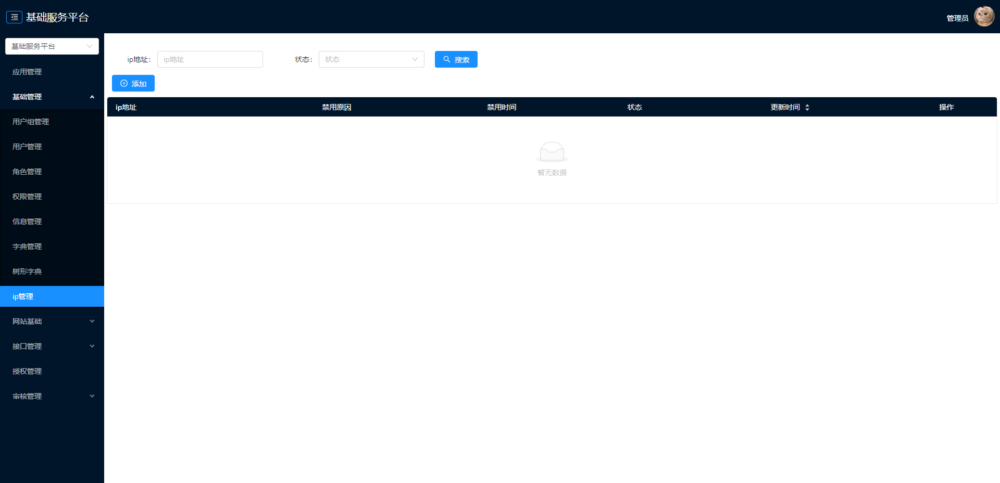
* 供应商管理
  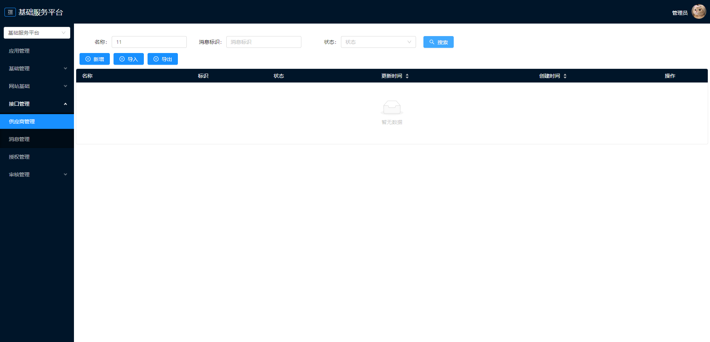
* 信息管理
  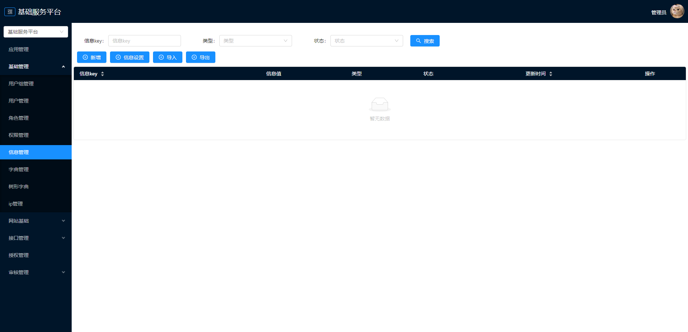
* 字典管理
  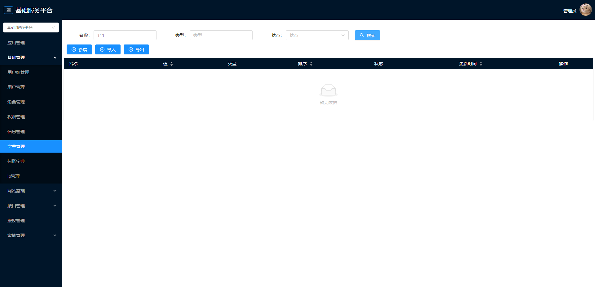
* 应用审核
  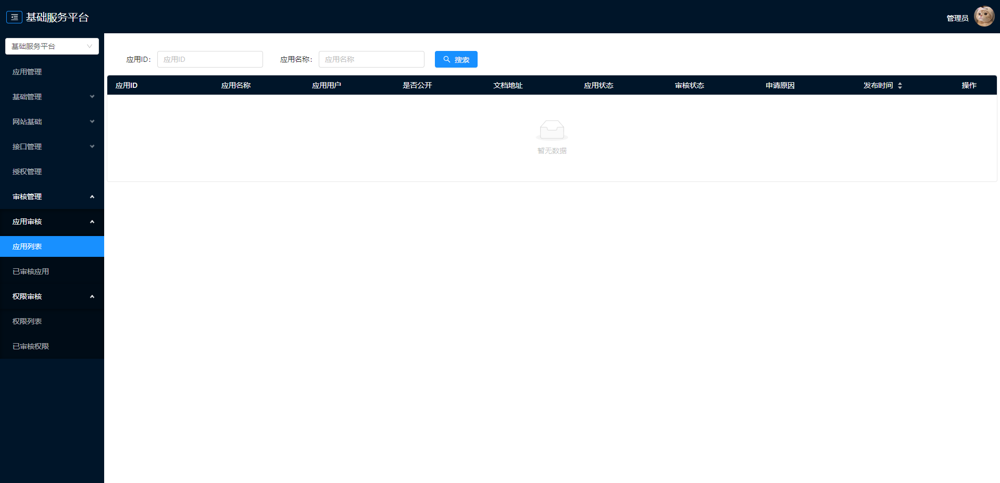
* 应用管理
  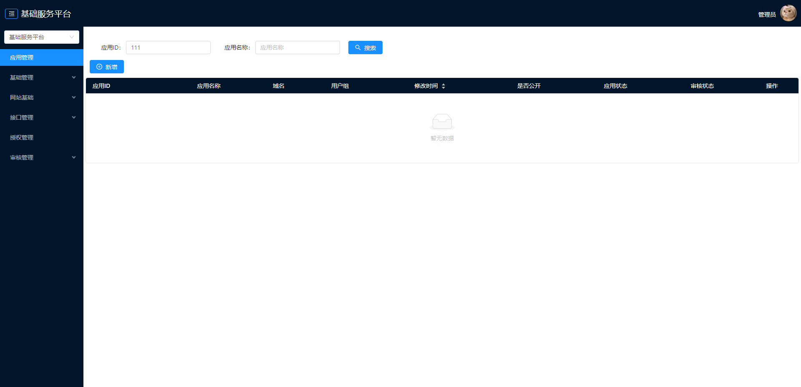
* 授权管理
  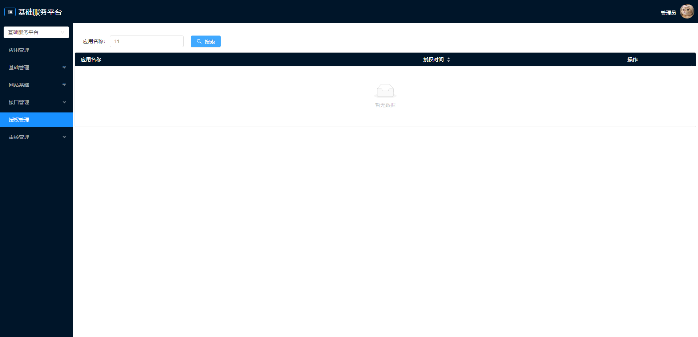
* 数据类型管理
  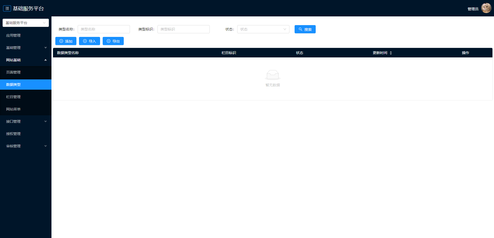
* 权限审核
  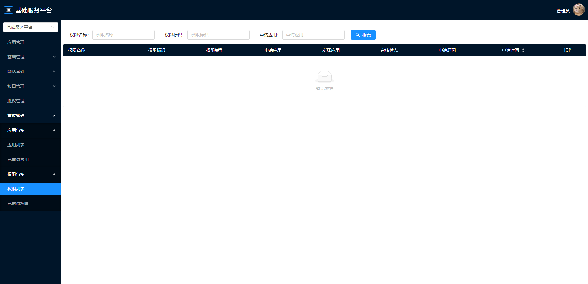
* 权限管理
  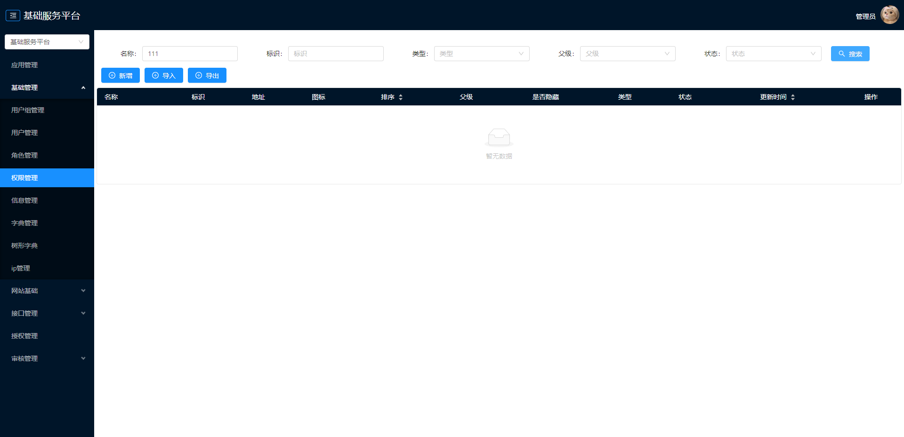
* 栏目管理
  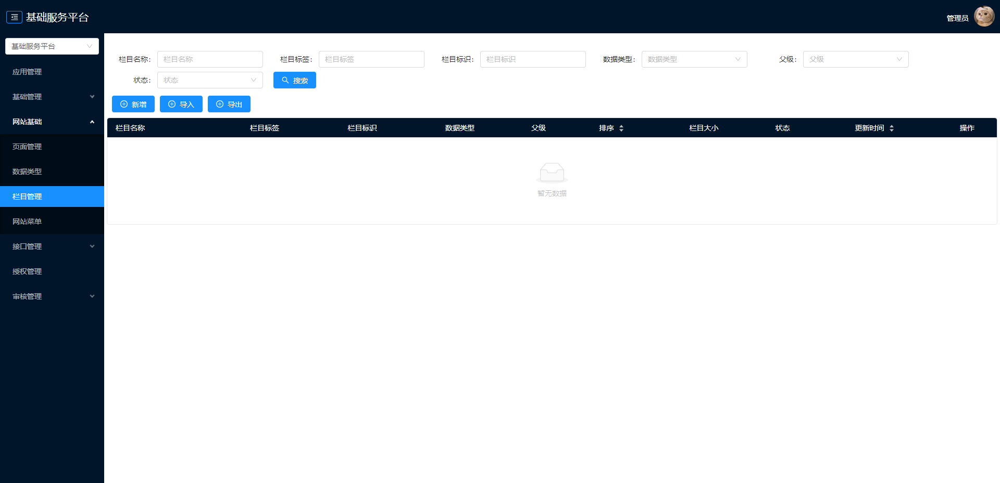
* 树形字典管理
  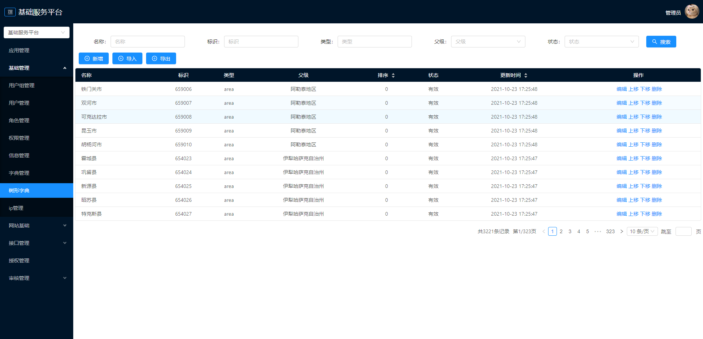
* 消息管理
  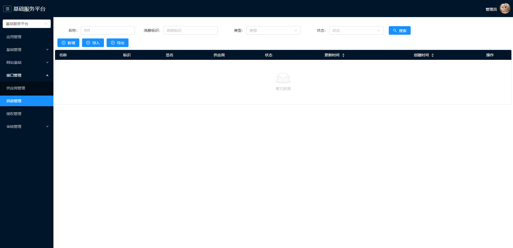
* 用户管理
  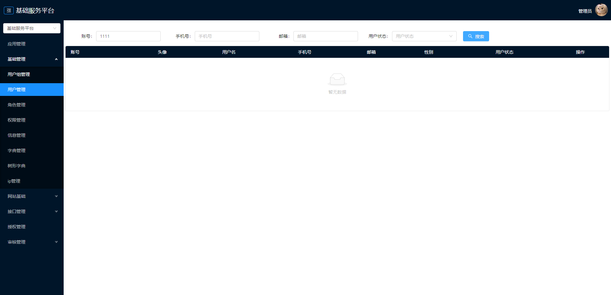
* 用户组管理
  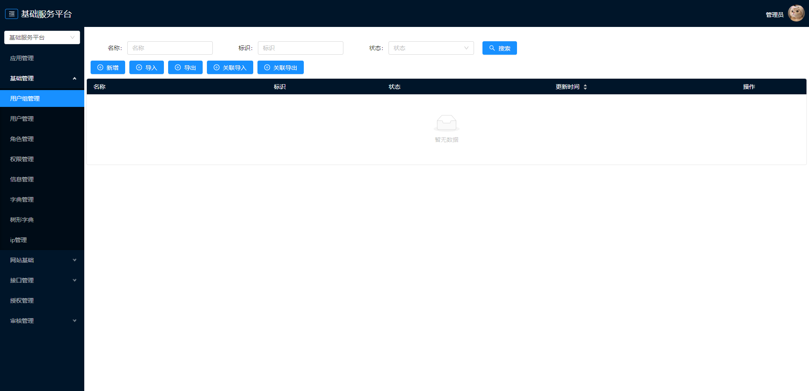
* 登录页面
  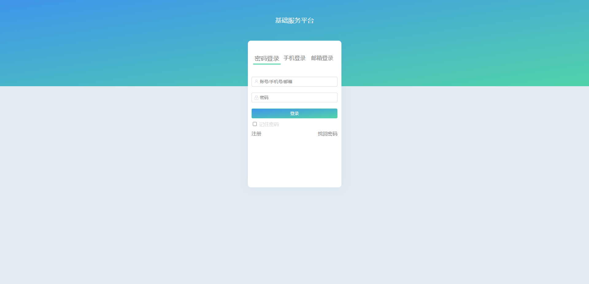
* 网站菜单管理
  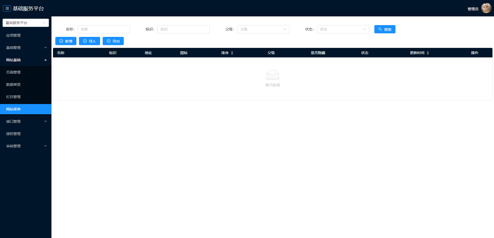
* 网站页面管理
  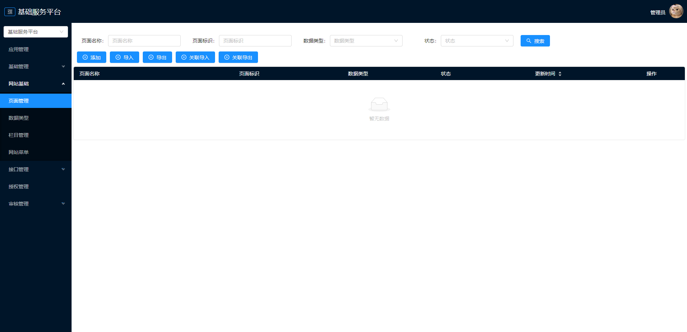
* 角色管理
  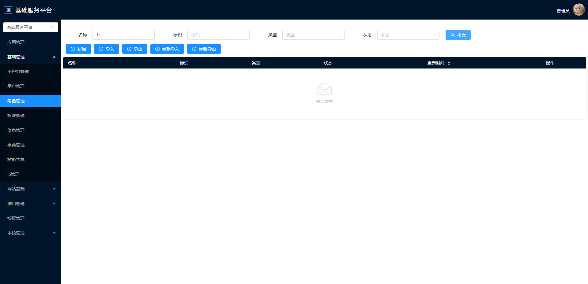

